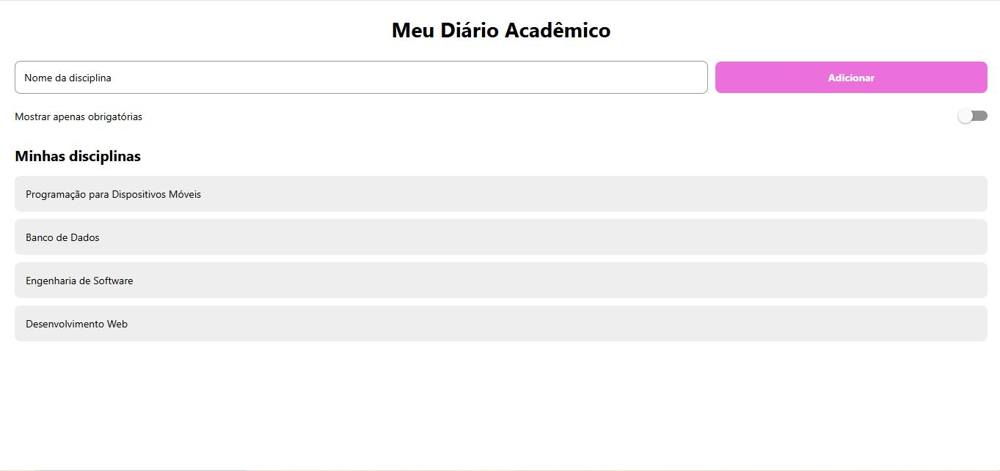

# MeuDiarioAcademico

Aplicativo desenvolvido em React Native utilizando Expo para a disciplina de Programação para Dispositivos Móveis.

## Sobre o projeto

O **MeuDiarioAcademico** é um aplicativo desenvolvido para cadastrar e visualizar disciplinas do semestre.

Nesta atividade foram utilizados componentes básicos do React Native, organização de código com `import/export`, `StyleSheet` e conceitos de Flexbox.

## Tecnologias utilizadas

* React Native
* Expo
* JavaScript
* Flexbox
* `react-native-safe-area-context`

## Criação do projeto

O projeto foi criado utilizando o seguinte comando:

```bash
npx create-expo-app@latest MeuDiarioAcademico --template blank
```

Para iniciar o projeto, foi utilizado:

```bash
npx expo start
```

## Funcionalidades desenvolvidas

* Cabeçalho com o nome do aplicativo.
* Campo para informar o nome da disciplina.
* Botão **Adicionar** utilizando `Pressable`.
* Lista de disciplinas.
* `Switch` para a opção **Mostrar apenas obrigatórias**.
* Layout utilizando Flexbox.
* Arquivo `labels.js` para organização dos textos da interface.

## Organização dos arquivos

```text
MeuDiarioAcademico/
├── App.js
├── labels.js
├── README.md
├── package.json
└── ...
```

## Prints da tela

### Tela inicial



> O print acima apresenta a tela inicial do aplicativo com o título, campo para cadastro de disciplina, botão Adicionar, opção de disciplinas obrigatórias e lista de disciplinas.

## Observações

A lista de disciplinas é estática nesta atividade, conforme solicitado no enunciado. O botão e o `Switch` foram implementados como parte do desafio opcional, sem adicionar ainda a lógica de cadastro ou filtragem.
