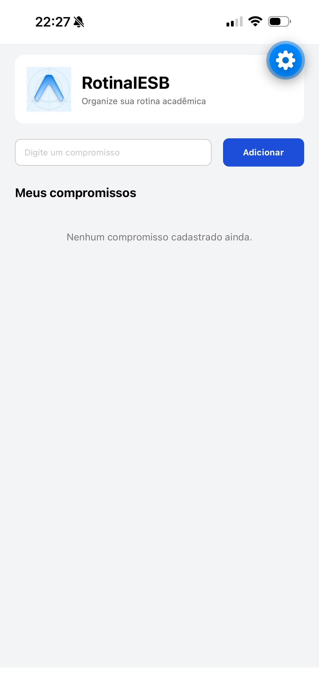
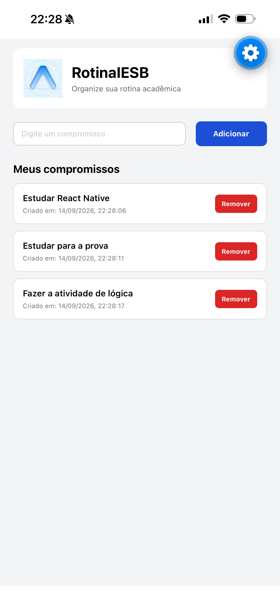

# 📱 RotinaIESB

Aplicativo desenvolvido como parte da **Atividade Integradora** da disciplina de **Programação para Dispositivos Móveis (React Native / Expo)** do IESB.

O aplicativo **RotinaIESB** tem como objetivo organizar compromissos da rotina acadêmica do aluno, permitindo cadastrar, visualizar e remover compromissos. Os dados são armazenados localmente utilizando **AsyncStorage**, permanecendo disponíveis mesmo após fechar e reabrir o aplicativo.

---

## 📚 Informações da atividade

* **Disciplina:** Programação para Dispositivos Móveis
* **Professor:** Marcelo Alves Farias
* **Aulas relacionadas:** 02, 03, 04, 05 e 06
* **Projeto:** RotinaIESB
* **Tecnologia:** React Native / Expo
* **Branch:** `feature/atividade03`

---

## 🎯 Objetivo

Consolidar os conteúdos estudados nas aulas 02 a 06 em um único aplicativo funcional.

Foram utilizados conceitos de:

* Estrutura de projetos Expo;
* Importação e exportação de módulos;
* Core Components do React Native;
* `StyleSheet`;
* Flexbox;
* `useState`;
* Props;
* Componentização;
* `Pressable`;
* `useEffect`;
* `AsyncStorage`;
* Persistência de dados com JSON.

---

## 🛠️ Criação do projeto

O projeto foi criado utilizando o template blank do Expo com o seguinte comando:

```bash
npx create-expo-app@latest RotinaIESB --template blank
```

Após a criação do projeto, foi acessada a pasta:

```bash
cd RotinaIESB
```

E foram instaladas as dependências necessárias:

```bash
npx expo install @react-native-async-storage/async-storage react-native-safe-area-context
```

Para iniciar o aplicativo:

```bash
npx expo start
```

---

## 📂 Estrutura do projeto

A estrutura principal utilizada no projeto é:

```text
RotinaIESB/
│
├── App.js
├── labels.js
├── app.json
├── package.json
├── README.md
│
├── assets/
│   └── logo.png
│
└── components/
    ├── CompromissoInput.js
    └── CompromissoList.js
```

---

## 🏷️ Labels

O arquivo `labels.js` foi criado para centralizar os principais textos utilizados no aplicativo.

Entre os rótulos utilizados estão:

* `tituloApp`
* `placeholderCompromisso`
* `botaoAdicionar`
* `tituloLista`
* `listaVazia`

Esses valores são exportados pelo arquivo e importados no `App.js` e/ou nos componentes.

Essa organização facilita a manutenção dos textos e demonstra o uso de **export/import** trabalhado nas aulas.

---

## 🖥️ Interface e layout

A tela principal utiliza:

* `SafeAreaProvider`;
* `SafeAreaView`;
* `View`;
* `Text`;
* `TextInput`;
* `Image`;
* `StyleSheet`;
* `Pressable`.

O cabeçalho utiliza `flexDirection: 'row'`, organizando a imagem e o título lado a lado.

A área de cadastro também utiliza Flexbox para posicionar o campo de texto e o botão de adicionar na mesma linha.

A área da lista utiliza `flex: 1` para ocupar o espaço restante da tela.

Os estilos foram organizados utilizando:

```javascript
StyleSheet.create()
```

Também foram utilizados recursos como:

* `width` em porcentagem;
* `flex`;
* `justifyContent`;
* `alignItems`;
* `flexDirection`.

---

## 🧩 Componentização

O aplicativo foi dividido em componentes para facilitar a organização do código.

### `components/CompromissoInput.js`

Responsável pela área de cadastro de novos compromissos.

Recebe informações por meio de **props**, como:

* valor digitado;
* função para alterar o texto;
* função para adicionar um compromisso;
* rótulos utilizados na interface.

### `components/CompromissoList.js`

Responsável pela exibição dos compromissos cadastrados.

Recebe por meio de **props**:

* lista de compromissos;
* função para remover um compromisso;
* título da lista;
* mensagem apresentada quando a lista está vazia.

A separação dos componentes facilita a reutilização e organização do código.

---

## 🔄 Estado com useState

O aplicativo utiliza `useState` para controlar:

1. O texto digitado no campo de cadastro;
2. A lista de compromissos cadastrados.

Cada compromisso possui a seguinte estrutura:

```javascript
{
  id,
  texto,
  criadoEm
}
```

O `id` é gerado de forma única para cada compromisso.

---

## ➕ Adicionando compromissos

Ao adicionar um compromisso, o aplicativo verifica se o campo está vazio.

Caso o usuário tente adicionar um compromisso sem texto, é apresentada uma mensagem utilizando:

```javascript
Alert.alert()
```

Quando o compromisso é válido, ele é adicionado à lista utilizando `setState` com um novo array.

---

## 🗑️ Removendo compromissos

Cada compromisso possui um botão de remoção utilizando `Pressable`.

A remoção é feita utilizando o método:

```javascript
.filter()
```

O compromisso é identificado pelo seu `id`, evitando utilizar o índice da lista como identidade do item.

Também foi utilizado feedback visual ao pressionar os elementos e `android_ripple` quando aplicável.

---

## 💾 Persistência com AsyncStorage

Para manter os compromissos salvos mesmo depois de fechar o aplicativo, foi utilizado o `AsyncStorage`.

A chave utilizada para armazenamento é:

```javascript
@rotina_iesb_compromissos
```

Os dados são convertidos para JSON antes de serem armazenados:

```javascript
JSON.stringify()
```

E convertidos novamente para objetos JavaScript quando carregados:

```javascript
JSON.parse()
```

---

## 🔃 useEffect de carregamento

O primeiro `useEffect` é utilizado para carregar os compromissos armazenados quando o aplicativo é aberto.

Ele:

1. Acessa o `AsyncStorage`;
2. Recupera os dados armazenados;
3. Utiliza `JSON.parse()` para transformar os dados em objetos;
4. Atualiza a lista de compromissos.

Esse `useEffect` é executado durante a montagem inicial do aplicativo.

---

## 💾 useEffect de salvamento

Outro `useEffect` é responsável por salvar a lista sempre que ela é modificada.

Ele:

1. Observa a lista de compromissos;
2. Converte os dados utilizando `JSON.stringify()`;
3. Salva o resultado no `AsyncStorage`.

Dessa forma, quando um compromisso é adicionado ou removido, os dados são atualizados no armazenamento local.

Os processos de carregamento e salvamento possuem `try/catch` para tratar possíveis erros e apresentar mensagens amigáveis ao usuário.

---

## 🧪 Testes realizados

Foram realizados testes para verificar o funcionamento das principais funcionalidades do aplicativo:

* Abertura do aplicativo;
* Exibição da tela vazia;
* Adição de compromissos;
* Exibição dos compromissos cadastrados;
* Remoção de compromissos;
* Fechamento do aplicativo;
* Reabertura do aplicativo;
* Recuperação dos compromissos utilizando `AsyncStorage`.

---

## 📸 Prints da aplicação

### 1. Tela vazia

Nesta tela é apresentada a aplicação sem compromissos cadastrados.

**Print:**



---

### 2. Tela com itens cadastrados

Nesta tela são apresentados alguns compromissos cadastrados pelo usuário.

**Print:**


---

### 3. Aplicativo após ser reaberto

Após fechar e abrir novamente o aplicativo, os compromissos permanecem cadastrados graças à persistência utilizando `AsyncStorage`.

**Print:**



---

## 📁 Arquivos criados

### Arquivos principais

* `App.js`
* `labels.js`
* `app.json`
* `package.json`
* `README.md`

### Componentes

* `components/CompromissoInput.js`
* `components/CompromissoList.js`

### Assets

* `assets/logo.png`

---

## ✅ Checklist dos requisitos

* [x] Projeto criado com Expo;
* [x] `labels.js` com exportação de constantes;
* [x] Importação dos rótulos;
* [x] `SafeAreaProvider`;
* [x] `SafeAreaView`;
* [x] `Image`;
* [x] `Text`;
* [x] `TextInput`;
* [x] `StyleSheet`;
* [x] Layout utilizando Flexbox;
* [x] `useState`;
* [x] Props;
* [x] Componentização;
* [x] `CompromissoInput`;
* [x] `CompromissoList`;
* [x] `Pressable`;
* [x] Identificadores únicos;
* [x] Remoção utilizando `.filter()`;
* [x] `useEffect`;
* [x] `AsyncStorage`;
* [x] `JSON.stringify()`;
* [x] `JSON.parse()`;
* [x] Persistência após fechar e reabrir o aplicativo;
* [ ] Inserir os três prints no README.

---

## 📌 Conclusão

O projeto **RotinaIESB** reúne os principais conteúdos das aulas 02 a 06, utilizando React Native e Expo para desenvolver uma aplicação simples de organização da rotina acadêmica.

A aplicação permite cadastrar e remover compromissos e utiliza armazenamento local para manter os dados mesmo após o fechamento do aplicativo.

O projeto também demonstra a utilização de componentes, props, estados, eventos, Flexbox, `useEffect`, `AsyncStorage` e persistência de dados em formato JSON.
